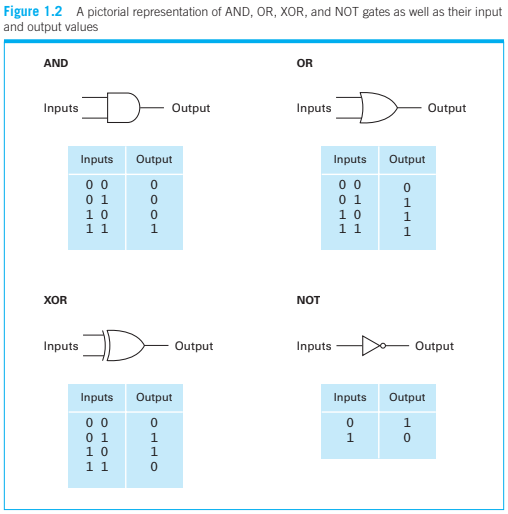
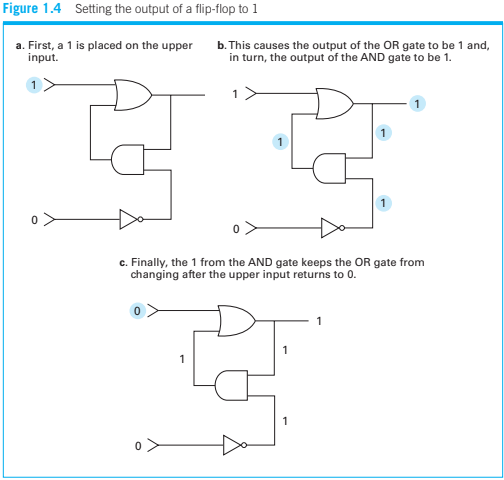
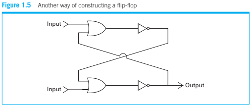
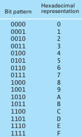

## **Chapter 0: Introduction**
##### **0.1 The Role of Algorithms** (pg. 14)
* algorithm is a set of instructions for doing something
* examples
    + long division algorithm
    + euclidian algorithm for greatest common divisor

##### **0.2 The History of Computing** (pg. 16)
* abacus stores data
* Blaise Pascal, Gottfried Wilhelm Leibniz, Charles Babbage used gears to make computing devices
* Joseph Jacquard weaving loom that used punch cards to do certain patterns
* Herman Hollerith took inspiration of punch cards to pitch quick
* ENIAC (Electronic Numerical Integrator And Computer/Calculator) by John Mauchly and J. Presper Eckert
* first vacuum tube machine was the Atanasoff-Berry machine in 1937-1941 in Iowa State College
    by john Atanasoff and Clifford Berry.
* 1976 first commercially viable home pc by Apple Inc.
* 1981 IBM first PC created by Microsoft

##### **0.4 The Overarching Themes of Computer Science** (pg. 23)
* Algorithms

* Abstraction
    + good for not getting overwhelmed
* Creativity
    + inherent in projects
* Data
    + represent any info that can be digitized
* Programming
    + translating intentions into algorithms for computers
* Internet

* Impact
    + can affect many aspects of lives such as gov, law, philosophy, social, economics

## **Chapter 1: Data Storage**
##### **1.1 Bits and Their Storage** (pg. 32)
* encoded as patters of 0s and 1s
* not actual values but representations of values depending on how they're read/deciphered
* Boolean Operations
    + 0 = false
    + 1 = true
    + combine input and produce output
    + AND
        - A is true AND B is true
    + OR
        - at least 1 statement must be true
    + XOR (exclusive or)
        - only true if exactly 1 is true
    + NOT
        - opposite of the input
        - A is true -> A is false
* Gates and Flip-Flops
    + Gate
        - produces boolean output when given input
        - could be gears, relays, optic devices
        - usually tiny circuits where 0 and 1 are voltages
        - represented by shapes with input(s) and an output

        
    + Flip-Flop
        - circuit that produces an output that stays contant until a pulse changes it
        - "remembers" the 0 or 1 

        
        - thought process:
            * if any current goes through OR, the output is 1
            * first input of AND is 1 now
            * no current through NOT means the second input of AND is 1
            * second input of OR is 1 constantly now
            * final output is a constant 1
        - very large-scale integration (VLSI) makes chip with lots of flip flops

        

* Hexadecimal Notation
    + bit stream
        - string of bits representing the internal activities of a pc
        - 101101010011 = B53
    + bits are usually in multiples of 4

    

##### **1.2 Main Memory** (pg. 38)
* Memory Organization
    + organized into cells
    + cell = 1 byte = 8 bits
    + bits envisioned in a row
        - left end = high-order end OR most significant bit
        - right end = low-order end OR least significant bit
    + Random Access Memory
        - needs to be refreshed
        - often called DRAM
* Measuring Memory Capacity
    + number of cells is measured in powers of 2
    + 210 = 1024 bytes AKA cells

##### **1.3 Mass Storage** (pg. 41)
* secondary storage AKA stuff like tapes, flash drives, solid-state disks (SSDs)
* Advantages:
    + less volatile
    + very big storage capacity
    + removable/archivable
* Disadvantages:
    + often need mechanical motion which is less fast than pulses
    + prone to mechanical failures
* Magnetic Systems 

    + TODO
